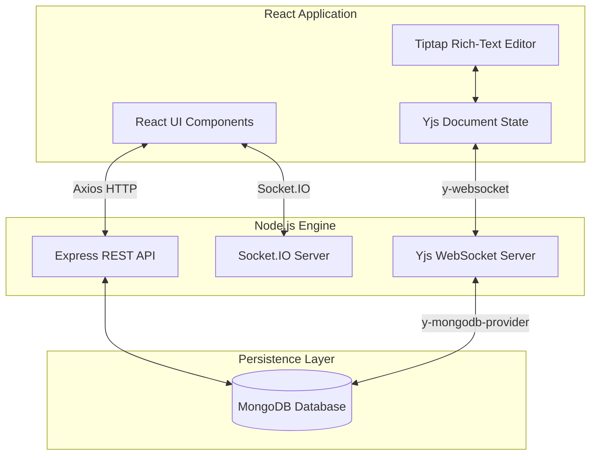

# EditNest 📝 — Real-Time Collaborative Document Editor

EditNest is a premium, state-of-the-art real-time collaborative document editing workspace designed for modern engineering teams. Powered by conflict-free replicated data types (CRDTs), EditNest enables seamless, zero-conflict simultaneous document editing, interactive threaded annotations, custom milestone backups, and multi-mode AI-driven writing transformations.

---

## 🏛️ System Architecture

EditNest uses a hybrid synchronization architecture:
1. **CRDT WebSocket Channel**: Synchronizes raw document state vectors bidirectionally using `Yjs` over binary WebSockets.
2. **Socket.IO Event Stream**: Transmits ephemeral collaborator presence state, typing indicators, live activity logging, and threaded comments.
3. **REST HTTP API**: Manages authenticated sessions, database queries, document sharing permissions, milestone snapshots, and AI transformations.



---

## ✨ Core Features

- **Conflict-Free Real-Time Sync**: Multi-user editing powered by **Yjs** and **Tiptap**. Collaborators receive updates instantly with color-coded cursors and name badges.
- **AI Writing Assistant**: Integrated NLP helpers simulating advanced AI inference:
  - **Fix Grammar**: Auto-capitalizes, fixes spacing, and formats punctuation.
  - **Summarize**: Instantly extracts key points and generates brief executive digests.
  - **Professional Tone**: Rewrites text into formal business communications.
  - **Text Expansion**: Generates technical additions explaining CRDT/WebSocket scaling.
  - **Translation**: Cross-translates text to Spanish, French, German, Italian, or Japanese.
  - **Next-Sentence Suggestion**: Appends recommendations for team collaboration workflows.
- **Threaded Discussions**: Contextual comments anchored to selected text nodes with support for nested conversation replies and resolution states.
- **Milestone Version History**: Capture points in time, compare historical documents side-by-side, and restore past versions.
- **Dashboard Telemetry**: Word counts, character counts, paragraph counts, estimated speaking/reading times, and lexical-based sentiment analysis.

---

## 📂 Directory Structure

```text
Collaborative Document Editor/
├── backend/
│   ├── controllers/         # REST endpoint controllers
│   │   ├── authController.js
│   │   ├── commentController.js
│   │   └── documentController.js
│   ├── middleware/          # Express authentication check middlewares
│   │   └── authMiddleware.js
│   ├── models/              # Mongoose data models
│   │   ├── Comment.js
│   │   ├── Document.js
│   │   ├── User.js
│   │   └── Version.js
│   ├── routes/              # Express API route mapping definitions
│   │   ├── authRoutes.js
│   │   └── documentRoutes.js
│   ├── server.js            # Node/Express server entry & websocket upgrade arbitrator
│   └── package.json
└── frontend/
    ├── public/
    ├── src/
    │   ├── api/             # Axios REST API client configurations
    │   │   └── auth.js
    │   ├── components/      # UI components & interactive modal drawers
    │   │   ├── ActivityTimelineModal.jsx
    │   │   ├── AiAssistantModal.jsx
    │   │   ├── AnalyticsModal.jsx
    │   │   ├── AuthModal.jsx
    │   │   ├── CommentsSidebar.jsx
    │   │   ├── Editor.jsx
    │   │   ├── Header.jsx
    │   │   ├── ShareModal.jsx
    │   │   └── VersionHistoryModal.jsx
    │   ├── socket/          # Socket.IO client interface instance
    │   │   └── socketClient.js
    │   ├── App.jsx          # Dashboard, router, and master layout
    │   ├── config.js        # Environment configurations
    │   └── main.jsx         # App bootstrap entry
    ├── package.json
    └── vite.config.js
```

---

## ⚙️ Configuration & Environment Variables

### Backend Configuration
Create a `.env` file inside the `backend/` directory:
```env
PORT=3001
MONGODB_URI=mongodb://127.0.0.1:27017/collab-docs
JWT_SECRET=your-secure-jwt-secret-key
```

### Frontend Configuration
Create a `.env` file inside the `frontend/` directory:
```env
VITE_API_URL=http://localhost:3001
VITE_WS_URL=ws://localhost:3001
```

---

## 🏃‍♂️ Local Installation & Setup

### Prerequisites
- Node.js (v18+)
- MongoDB running locally or a MongoDB Atlas cloud database instance

### 1. Set Up Backend
```bash
cd backend
npm install
# Start server on http://localhost:3001
npm start
```

### 2. Set Up Frontend
```bash
cd frontend
npm install
# Start dev server on http://localhost:5173
npm run dev
```

---

## ☁️ Render Deployment Guide

Both frontend and backend services are configured to be deployed on Render as two decoupled web services.

### 1. Deploy the Backend (Web Service)
- **Service Type**: Web Service
- **Root Directory**: `backend`
- **Build Command**: `npm install`
- **Start Command**: `npm start`
- **Environment Variables**:
  - Set `MONGODB_URI` to your MongoDB Atlas connection string.
  - Set `JWT_SECRET` to a secure string.

### 2. Deploy the Frontend (Static Site)
- **Service Type**: Static Site
- **Root Directory**: `frontend`
- **Build Command**: `npm run build`
- **Publish Directory**: `dist`
- **Environment Variables**:
  - Set `VITE_API_URL` to your backend Render URL (e.g. `https://editnest-backend.onrender.com`).
  - Set `VITE_WS_URL` to your backend WebSocket URL (e.g. `wss://editnest-backend.onrender.com`).

---

## 📊 API Reference

| Method | Endpoint | Description | Auth Required |
|:---|:---|:---|:---|
| **POST** | `/api/auth/register` | Register a new user account | No |
| **POST** | `/api/auth/login` | Authenticate credentials and issue JWT | No |
| **GET** | `/api/auth/me` | Fetch active user profile | **Yes (Bearer JWT)** |
| **GET** | `/api/auth/users` | Directory lookup suggestion query | No |
| **POST** | `/api/documents` | Create a new document session | Optional |
| **GET** | `/api/documents` | Retrieve accessible documents list | Optional |
| **GET** | `/api/documents/:id` | Fetch specific document metadata | Optional |
| **PUT** | `/api/documents/:id` | Update document fields | Optional |
| **DELETE** | `/api/documents/:id` | Permanently delete document & history | Optional |
| **POST** | `/api/documents/:id/share` | Invite collaborator with specific role | Optional |
| **DELETE** | `/api/documents/:id/collaborator/:email` | Revoke collaborator permissions | Optional |
| **GET** | `/api/documents/:id/versions` | List all historical snapshots | Optional |
| **POST** | `/api/documents/:id/versions` | Capture a named content snapshot | Optional |
| **POST** | `/api/documents/:id/versions/:versionId/restore` | Restore past milestone content | Optional |
| **GET** | `/api/documents/:id/comments` | Retrieve comment discussion threads | Optional |
| **POST** | `/api/documents/:id/comments` | Post a new anchored comment thread | Optional |
| **POST** | `/api/documents/:id/comments/:commentId/reply` | Reply to an existing comment | Optional |
| **PUT** | `/api/documents/:id/comments/:commentId/resolve` | Toggle resolution status | Optional |
| **POST** | `/api/ai/transform` | Execute AI writing assistant modes | No |

---

## 🔌 Socket.IO Events

| Event Name | Direction | Description |
|:---|:---|:---|
| `join-document` | Client ➔ Server | Join document presence room and notify active users. |
| `typing` | Client ➔ Server | Send typing indicator state changes. |
| `user-typing` | Server ➔ Client | Broadcast typing indicator to all document editors. |
| `save-document` | Client ➔ Server | Trigger background auto-save preview updates. |
| `comment-added` | Client ➔ Server | Stream comments updates and log action logs. |
| `new-comment` | Server ➔ Client | Broadcast newly posted comments to users. |
| `version-saved` | Client ➔ Server | Broadcast new document snapshot milestone save. |
| `activity-log` | Server ➔ Client | Emit activity logs (joins, leaves, comment events, saves). |
| `disconnect` | Client ➔ Server | Handle user disconnection and cleanup state. |
